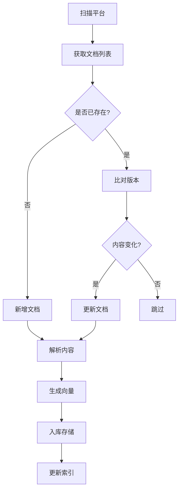

# 系统架构设计

本文档详细介绍企业内部知识管理系统的架构设计，包括系统组件、数据流、技术选型等。

## 目录

- [架构概览](#架构概览)
- [核心组件](#核心组件)
- [数据流设计](#数据流设计)
- [技术栈](#技术栈)
- [数据库设计](#数据库设计)
- [API 设计](#api-设计)
- [安全设计](#安全设计)
- [扩展性设计](#扩展性设计)
- [性能优化](#性能优化)

## 架构概览

### 系统架构图
```
┌─────────────────────────────────────────────────────────────┐
│                        用户界面                              │
├─────────────────────────────────────────────────────────────┤
│  Web Portal  │  Mobile App  │  API Client  │  Admin Panel   │
└─────────────────────────────────────────────────────────────┘
                              │
                              ▼
┌─────────────────────────────────────────────────────────────┐
│                        API 网关                              │
│  (认证、限流、路由、日志)                                    │
└─────────────────────────────────────────────────────────────┘
                              │
                              ▼
┌─────────────────────────────────────────────────────────────┐
│                      业务服务层                              │
├───────────────┬───────────────┬───────────────┬───────────────┤
│   查询服务    │   文档服务    │   用户服务    │   管理服务    │
│   (Query)     │  (Document)   │   (User)     │   (Admin)     │
└───────────────┴───────────────┴───────────────┴───────────────┘
                              │
                              ▼
┌─────────────────────────────────────────────────────────────┐
│                        Agent 层                             │
├─────────────────────────────────────────────────────────────┤
│  意图识别 Agent │  检索 Agent  │  生成 Agent  │  同步 Agent   │
└─────────────────────────────────────────────────────────────┘
                              │
                              ▼
┌─────────────────────────────────────────────────────────────┐
│                        服务层                                │
├───────────────┬───────────────┬───────────────┬───────────────┤
│   文档解析    │   向量存储    │   缓存服务    │   消息队列    │
│   (Parser)    │ (Vector DB)  │   (Cache)    │   (Message)   │
└───────────────┴───────────────┴───────────────┴───────────────┘
                              │
                              ▼
┌─────────────────────────────────────────────────────────────┐
│                        基础设施                              │
├───────────────┬───────────────┬───────────────┬───────────────┤
│   PostgreSQL  │     Redis     │    文件存储    │   监控告警    │
│    (SQL)      │   (Cache)    │   (Storage)   │   (Monitor)   │
└───────────────┴───────────────┴───────────────┴───────────────┘
```

### 设计原则
1. **模块化设计**：各组件职责清晰，松耦合
2. **可扩展性**：支持水平扩展和功能扩展
3. **高性能**：缓存、异步处理、负载均衡
4. **可维护性**：清晰的代码结构、完善的日志
5. **安全性**：认证授权、数据加密、安全审计

## 核心组件

### 1. 文档同步与治理 Agent

#### 职责
- 定期扫描多个平台的文档
- 自动识别新增、修改、删除的文档
- 进行版本比对和去重
- 结构化解析文档内容
- 提取关键词和生成向量
- 构建统一的企业知识库
- 标记过时信息，提醒更新

#### 工作流程


#### 关键特性
- **多平台支持**：飞书、Confluence、本地文档等
- **增量同步**：只同步变化的文档
- **智能去重**：基于内容哈希和标题相似度
- **格式解析**：PDF、Word、Excel、Markdown等
- **质量控制**：自动检测文档质量问题

### 2. 用户意图理解与检索 Agent

#### 职责
- 接收用户提问
- 理解用户真实需求
- 拆解问题关键词
- 调用向量数据库检索
- 重排序搜索结果
- 生成相关性评分

#### 意图识别
```python
# 意图类型分类
IntentType = {
    "information_seeking": "信息查询",
    "procedural_inquiry": "流程咨询", 
    "policy_check": "政策核查",
    "training_request": "培训需求",
    "complaint": "投诉反馈",
    "other": "其他"
}
```

#### 检索策略
1. **语义检索**：基于向量相似度
2. **关键词匹配**：基于关键词权重
3. **混合检索**：结合多种检索方式
4. **结果重排序**：多因素评分机制

### 3. 答案生成与校验 Agent

#### 职责
- 基于检索到的文档片段
- 生成通俗易懂的回答
- 标注信息来源和更新时间
- 检测信息矛盾和过期
- 处理无法回答的问题

#### 答案类型
```python
AnswerType = {
    "direct_answer": "直接回答",
    "procedural_guide": "流程指导",
    "policy_reference": "政策引用", 
    "training_material": "培训材料",
    "multiple_source": "多源综合",
    "unclear": "不明确",
    "escalated": "需人工处理"
}
```

#### 质量控制
- **时效性检查**：判断信息是否过期
- **矛盾检测**：识别不同来源的矛盾信息
- **置信度评估**：评估答案的可信程度
- **来源标注**：明确信息出处和更新时间

## 数据流设计

### 完整数据流
```
1. 文档同步阶段
   平台扫描 → 获取文档 → 内容解析 → 向量生成 → 知识入库

2. 查询处理阶段
   用户提问 → 意图识别 → 向量检索 → 结果重排 → 答案生成 → 返回结果

3. 反馈优化阶段
   用户反馈 → 质量评估 → 策略调整 → 持续学习
```

### 详细流程

#### 文档同步流程
1. **定时触发**：根据配置的时间间隔启动同步
2. **平台连接**：使用平台 API 或文件系统访问
3. **文档获取**：获取文档列表和基本信息
4. **变更检测**：对比已有文档，识别变更
5. **内容解析**：提取文本、元数据、结构信息
6. **预处理**：清洗文本、分块、提取关键词
7. **向量化**：生成文本嵌入向量
8. **存储入库**：更新数据库和向量数据库

#### 查询处理流程
1. **接收请求**：API 网关接收查询请求
2. **身份认证**：验证用户身份和权限
3. **意图识别**：分析用户问题的真实意图
4. **实体提取**：识别问题中的关键实体
5. **语义检索**：在向量空间中查找相似内容
6. **结果过滤**：根据权限和来源过滤结果
7. **重排序**：综合相关性、时效性等因素
8. **答案生成**：基于检索结果生成回答
9. **质量校验**：检查答案的准确性和完整性
10. **返回响应**：返回格式的查询结果

#### 反馈优化流程
1. **用户反馈**：收集评分和评价反馈
2. **质量评估**：分析回答的准确性
3. **问题定位**：识别问题和不足
4. **策略调整**：优化检索和生成策略
5. **模型更新**：持续学习和改进

## 技术栈

### 后端技术栈
| 技术 | 用途 | 版本 |
|------|------|------|
| FastAPI | Web 框架 | 0.104.1 |
| SQLAlchemy | ORM 框架 | 2.0.23 |
| Pydantic | 数据验证 | 2.5.0 |
| Uvicorn | ASGI 服务器 | 0.24.0 |
| Celery | 任务队列 | 5.3.4 |

### AI/ML 技术栈
| 技术 | 用途 | 版本 |
|------|------|------|
| LangChain | AI 框架 | 0.1.0 |
| OpenAI | 语言模型 | API |
| Anthropic | 语言模型 | API |
| Sentence Transformers | 向量模型 | 2.2.2 |
| ChromaDB | 向量数据库 | 0.4.18 |

### 数据存储
| 技术 | 用途 | 版本 |
|------|------|------|
| PostgreSQL | 关系数据库 | 13+ |
| Redis | 缓存 | 6.0+ |
| Milvus | 向量数据库 | 2.3.4 |
| MinIO | 对象存储 | (可选) |

### 基础设施
| 技术 | 用途 | 版本 |
|------|------|------|
| Docker | 容器化 | 20.10+ |
| Kubernetes | 容器编排 | 1.25+ |
| Nginx | 反向代理 | 1.18+ |
| Prometheus | 监控 | 2.40+ |

### 开发工具
| 技术 | 用途 |
|------|------|
| Git | 版本控制 |
| Black | 代码格式化 |
| Isort | 导入排序 |
| Flake8 | 代码检查 |
| Pytest | 单元测试 |

## 数据库设计

### 核心表结构

#### 文档表 (documents)
```sql
CREATE TABLE documents (
    id SERIAL PRIMARY KEY,
    title VARCHAR(500) NOT NULL,
    content TEXT NOT NULL,
    summary TEXT,
    document_type VARCHAR(50) NOT NULL,
    status VARCHAR(20) NOT NULL DEFAULT 'draft',
    author VARCHAR(100),
    department VARCHAR(100),
    tags VARCHAR(500),
    version VARCHAR(50) DEFAULT '1.0',
    word_count INTEGER DEFAULT 0,
    platform_id INTEGER REFERENCES platforms(id),
    source_url VARCHAR(1000),
    source_id VARCHAR(500),
    created_at TIMESTAMP DEFAULT NOW(),
    updated_at TIMESTAMP DEFAULT NOW(),
    published_at TIMESTAMP,
    is_deleted BOOLEAN DEFAULT FALSE,
    content_hash VARCHAR(64) UNIQUE
);
```

#### 知识块表 (knowledge_chunks)
```sql
CREATE TABLE knowledge_chunks (
    id SERIAL PRIMARY KEY,
    document_id INTEGER REFERENCES documents(id),
    content TEXT NOT NULL,
    summary TEXT,
    chunk_index INTEGER NOT NULL,
    vector_id VARCHAR(500) UNIQUE,
    embedding JSONB,
    keywords VARCHAR(1000),
    topics VARCHAR(500),
    importance_score FLOAT DEFAULT 0.0,
    word_count INTEGER DEFAULT 0,
    start_char INTEGER,
    end_char INTEGER,
    status VARCHAR(20) DEFAULT 'active',
    created_at TIMESTAMP DEFAULT NOW(),
    updated_at TIMESTAMP DEFAULT NOW()
);
```

#### 平台表 (platforms)
```sql
CREATE TABLE platforms (
    id SERIAL PRIMARY KEY,
    name VARCHAR(100) NOT NULL,
    platform_type VARCHAR(50) NOT NULL,
    description TEXT,
    base_url VARCHAR(500),
    config TEXT,
    is_active BOOLEAN DEFAULT TRUE,
    sync_enabled BOOLEAN DEFAULT TRUE,
    auth_config TEXT,
    total_documents INTEGER DEFAULT 0,
    last_sync_at TIMESTAMP,
    next_sync_at TIMESTAMP,
    created_at TIMESTAMP DEFAULT NOW(),
    updated_at TIMESTAMP DEFAULT NOW()
);
```

#### 用户表 (users)
```sql
CREATE TABLE users (
    id SERIAL PRIMARY KEY,
    username VARCHAR(100) UNIQUE NOT NULL,
    email VARCHAR(255) UNIQUE NOT NULL,
    full_name VARCHAR(200) NOT NULL,
    role VARCHAR(50) DEFAULT 'employee',
    hashed_password VARCHAR(255) NOT NULL,
    is_active BOOLEAN DEFAULT TRUE,
    is_verified BOOLEAN DEFAULT FALSE,
    department VARCHAR(100),
    position VARCHAR(100),
    employee_id VARCHAR(50),
    language VARCHAR(10) DEFAULT 'zh-CN',
    timezone VARCHAR(50) DEFAULT 'Asia/Shanghai',
    total_questions INTEGER DEFAULT 0,
    helpful_answers INTEGER DEFAULT 0,
    last_login_at TIMESTAMP,
    created_at TIMESTAMP DEFAULT NOW(),
    updated_at TIMESTAMP DEFAULT NOW()
);
```

#### 交互表 (interactions)
```sql
CREATE TABLE interactions (
    id SERIAL PRIMARY KEY,
    user_id INTEGER REFERENCES users(id),
    interaction_type VARCHAR(50) NOT NULL,
    status VARCHAR(20) DEFAULT 'pending',
    query TEXT,
    response TEXT,
    feedback VARCHAR(500),
    rating FLOAT,
    knowledge_chunk_id INTEGER REFERENCES knowledge_chunks(id),
    document_id INTEGER REFERENCES documents(id),
    relevance_score FLOAT DEFAULT 0.0,
    response_time FLOAT,
    tokens_used INTEGER DEFAULT 0,
    assigned_to VARCHAR(100),
    resolved_at TIMESTAMP,
    resolution_notes TEXT,
    created_at TIMESTAMP DEFAULT NOW(),
    updated_at TIMESTAMP DEFAULT NOW()
);
```

### 数据库优化策略

#### 索引设计
```sql
-- 文档表索引
CREATE INDEX idx_documents_title ON documents USING gin(to_tsvector('chinese', title));
CREATE INDEX idx_documents_status ON documents(status);
CREATE INDEX idx_documents_platform ON documents(platform_id);
CREATE INDEX idx_documents_created_at ON documents(created_at);

-- 知识块索引
CREATE INDEX idx_chunks_document ON knowledge_chunks(document_id);
CREATE INDEX idx_chunks_status ON knowledge_chunks(status);
CREATE INDEX idx_chunks_keywords ON knowledge_chunks USING gin(to_tsvector('chinese', keywords));

-- 用户表索引
CREATE INDEX idx_users_username ON users(username);
CREATE INDEX idx_users_email ON users(email);
CREATE INDEX idx_users_role ON users(role);

-- 交互表索引
CREATE INDEX idx_interactions_user ON interactions(user_id);
CREATE INDEX idx_interactions_type ON interactions(interaction_type);
CREATE INDEX idx_interactions_status ON interactions(status);
```

#### 分区策略
```sql
-- 按时间分区交互数据
CREATE TABLE interactions_y2024m01 PARTITION OF interactions
    FOR VALUES FROM ('2024-01-01') TO ('2024-02-01');

-- 按用户ID分区用户数据（按范围）
CREATE TABLE users_range PARTITION OF users
    FOR VALUES WITH (MODULUS 10, REMAINDER 0);
```

## API 设计

### RESTful API 规范

#### 基础原则
1. 使用 HTTP 方法语义化：
   - GET：查询资源
   - POST：创建资源
   - PUT：更新资源
   - DELETE：删除资源

2. 统一的响应格式：
   ```json
   {
     "success": true/false,
     "data": {},
     "message": "",
     "error": "",
     "timestamp": "ISO8601"
   }
   ```

3. 标准的状态码：
   - 200：成功
   - 201：创建成功
   - 400：请求错误
   - 401：未认证
   - 403：无权限
   - 404：资源不存在
   - 429：频率限制
   - 500：服务器错误

#### API 版本控制
```
/api/v1/          # 当前版本
/api/v2/          # 未来版本
/api/legacy/      # 废弃版本
```

#### 认证机制
```
Authorization: Bearer <JWT_TOKEN>
```

### 核心接口设计

#### 查询接口
```typescript
// POST /api/v1/query
interface QueryRequest {
  query: string;          // 查询文本
  user_id: number;       // 用户ID
  filters?: {            // 可选过滤条件
    department?: string;
    document_type?: string;
    time_range?: string;
  };
}

interface QueryResponse {
  success: boolean;
  data: {
    intent: string;           // 识别的意图
    answer: string;           // 生成的答案
    answer_type: string;      // 答案类型
    confidence: number;       // 置信度
    sources: Source[];        // 来源信息
    warnings: string[];       // 警告信息
    suggestions: string[];    // 建议问题
  };
}
```

#### 文档管理接口
```typescript
// 文档列表
GET /api/v1/documents?page=1&limit=20&status=published

// 文档详情
GET /api/v1/documents/{id}

// 文档搜索
GET /api/v1/search?q=关键词&type=policy

// 文档同步
POST /api/v1/documents/sync/{platform_id}
```

#### 统计接口
```typescript
// GET /api/v1/statistics
interface StatisticsResponse {
  total_documents: number;
  active_users: number;
  average_response_time: number;
  popular_queries: QueryStat[];
  document_distribution: TypeStat[];
}
```

## 安全设计

### 认证与授权

#### JWT Token 设计
```python
# Token 载荷
{
  "sub": "user_id",
  "username": "user_name", 
  "role": "admin/employee",
  "exp": 1620000000,
  "iat": 1620000000,
  "type": "access"
}
```

#### 权限控制
```python
# 角色权限矩阵
RolePermissions = {
    "admin": {
        "documents": ["read", "write", "delete", "manage"],
        "users": ["read", "write", "delete"],
        "platforms": ["read", "write", "delete"],
        "system": ["read", "write"]
    },
    "manager": {
        "documents": ["read", "write"],
        "users": ["read"],
        "platforms": ["read"],
        "system": ["read"]
    },
    "employee": {
        "documents": ["read"],
        "users": ["read"],
        "platforms": ["read"],
        "system": []
    }
}
```

### 数据安全

#### 敏感数据保护
1. **数据加密**：
   - 传输层：HTTPS
   - 存储层：数据库字段加密
   - 密码：bcrypt 哈希

2. **访问控制**：
   - 基于 RBAC 的权限控制
   - API 网关认证
   - 资源级权限

3. **审计日志**：
   - 记录所有敏感操作
   - 保存操作人、时间、内容
   - 定期审计分析

#### 防护措施
```python
# SQL 注入防护
cursor.execute("SELECT * FROM users WHERE id = %s", (user_id,))

# XSS 防护
response.headers["Content-Security-Policy"] = "default-src 'self'"

# CSRF 防护
@app.middleware("http")
async def csrf_middleware(request: Request, call_next):
    # CSRF Token 检查逻辑
```

## 扩展性设计

### 微服务架构

#### 服务拆分
```
┌─────────────────┐  ┌─────────────────┐  ┌─────────────────┐
│   Query Service  │  │ Document Service │  │ Auth Service   │
│   - 查询处理      │  │ - 文档管理      │  │ - 用户认证      │
│   - 意图识别      │  │ - 内容解析      │  │ - 权限控制      │
│   - 答案生成      │  │ - 向量存储      │  │ - Token 管理    │
└─────────────────┘  └─────────────────┘  └─────────────────┘
```

#### 服务通信
```python
# 同步调用
http://query-service/health

# 异步消息
celery.send_task('process_document', args=(doc_id,))

# 服务发现
consul.catalog.services()
```

### 水平扩展

#### 负载均衡
```nginx
upstream backend {
    server 10.0.0.1:8000;
    server 10.0.0.2:8000;
    server 10.0.0.3:8000;
}

server {
    location / {
        proxy_pass http://backend;
    }
}
```

#### 数据库分片
```python
# 按用户ID分片
SHARD_MAPPING = {
    'user_1-1000': 'db_1',
    'user_1001-2000': 'db_2',
    'user_2001-3000': 'db_3'
}
```

### 插件化设计

#### Agent 扩展
```python
class BaseAgent(ABC):
    @abstractmethod
    async def process(self, input_data: Dict) -> Dict:
        pass

class CustomAgent(BaseAgent):
    async def process(self, input_data: Dict) -> Dict:
        # 自定义处理逻辑
        pass
```

#### 数据源扩展
```python
class DataSource(ABC):
    @abstractmethod
    async def fetch_documents(self) -> List[Document]:
        pass

class FeishuDataSource(DataSource):
    async def fetch_documents(self) -> List[Document]:
        # 飞书数据源实现
        pass
```

## 性能优化

### 缓存策略

#### 多级缓存
```python
# L1: 内存缓存
@lru_cache(maxsize=1000)

# L2: Redis 缓存
redis.setex(f"doc:{doc_id}", 3600, json.dumps(data))

# L3: CDN 缓存
Cache-Control: public, max-age=3600
```

#### 缓存失效
```python
# 主动失效
def update_document(doc_id):
    # 更新数据
    update_data_in_db(doc_id)
    # 清除缓存
    cache.delete(f"doc:{doc_id}")
    cache.delete(f"query:related:{doc_id}")
```

### 数据库优化

#### 查询优化
```python
# 使用索引
query = db.query(Document).filter(
    Document.title.ilike(f"%{keyword}%"),
    Document.status == "published"
)

# 分页优化
query.offset(offset).limit(limit).all()
```

#### 连接池配置
```python
# SQLAlchemy 连接池
engine = create_engine(
    DATABASE_URL,
    pool_size=20,
    max_overflow=30,
    pool_pre_ping=True,
    pool_recycle=3600
)
```

### 并发处理

#### 异步架构
```python
# FastAPI 路由
@app.post("/query")
async def query_documents(request: QueryRequest):
    # 并行处理
    results = await asyncio.gather(
        intent_agent.process(request),
        retrieval_agent.process(request)
    )
```

#### 任务队列
```python
# Celery 任务
@celery.task
def process_document_async(doc_id):
    # 耗时处理
    pass
```

### 监控和告警

#### 性能指标
```python
# 关键指标
- 响应时间 < 500ms
- 吞吐量 > 1000 QPS
- 错误率 < 0.1%
- CPU 使用率 < 70%
- 内存使用率 < 80%
```

#### 告警规则
```yaml
rules:
  - name: high_error_rate
    condition: error_rate > 0.01
    duration: 5m
    action: notify_team
```

## 总结

本系统采用现代化的架构设计，具备以下特点：

1. **高可用性**：微服务架构、负载均衡、故障自愈
2. **高性能**：多级缓存、异步处理、数据库优化
3. **可扩展**：插件化设计、水平扩展、微服务架构
4. **安全性**：认证授权、数据加密、审计日志
5. **可维护**：模块化设计、完善的监控、清晰的文档

通过合理的架构设计，系统能够满足企业级应用的需求，支持大规模用户和高并发访问。